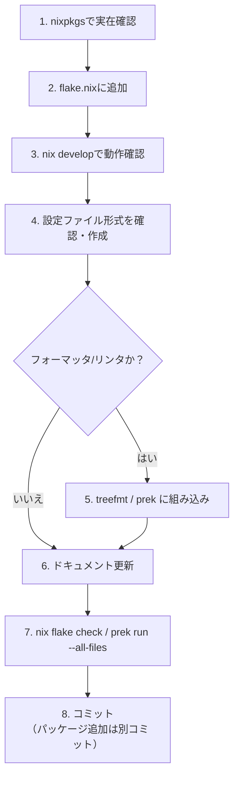

# devShell へのツール導入

新しい CLI ツールを devShell（`flake.nix`）に導入する際の定型手順。



## 手順

1. **nixpkgs での実在確認**（推測でパッケージ名を書かない）:

   ```sh
   nix eval --raw --impure --expr 'let flake = builtins.getFlake (toString ./.); pkgs = flake.inputs.nixpkgs.legacyPackages.${builtins.currentSystem}; name = "<name>"; in if pkgs ? ${name} then "FOUND ${pkgs.${name}.version or "?"}: ${pkgs.${name}.meta.description or ""}" else "NOT FOUND"'
   ```

   `meta.description` が期待するツールと一致するか確かめる（名前が似た別物の可能性に注意）。

2. **`flake.nix` に追加する**。追加先は次のとおり判断する。
   - フォーマッタ・リンタ: まず treefmt-nix に対応するプログラムがあるか確認し（下記コマンド）、あれば `treefmt.programs.<name>` で有効化する。devShell の `packages` には追加しない（`treefmt` ラッパー経由で実行されるため）
   - それ以外（言語ツールチェーン、Gitフックから直接呼ぶツール等）: `devShells.default.packages` に追加する

   ```sh
   ls "$(nix eval --raw --impure --expr '(builtins.getFlake (toString ./.)).inputs.treefmt-nix.outPath')/programs"
   ```

3. **`nix develop --command bash -c '<tool> --version'`** で実際に取得・起動できるか確認する。

4. **CLI のヘルプや `init`/`config` 系サブコマンドで設定ファイル形式とデフォルト値を確認**してから、このリポジトリに実際に適用してみる。ベースラインの警告・エラーを確認し、必要なら設定ファイルを作成する。設定はデフォルトと異なる項目のみ書く（推測で書かない）。

5. **フォーマッタ・リンタなら組み込み先を決める**。
   - treefmt: 手動・エージェント実行（`treefmt`）、`nix flake check`、prek の `treefmt` フックのすべてから実行される。ファイル単位で完結するツールはここに組み込む
   - `.pre-commit-config.yaml`: ファイル単位で完結しないツール（Git の状態を見る、特定のステージで動かす等）はここに `language: system` のフックとして追加する

6. **ドキュメントを更新する**。全体に関わる内容は `AGENTS.md`、特定のファイル種別に紐づく内容は該当する `.claude/rules/*.md`（無ければ新規作成し、`paths` で対象を絞る）に書く。`.claude/rules/docs.md` に従い、設定ファイルを見れば分かる内容は書かない。

7. **`nix flake check` と `prek run --all-files`** で最終確認する。

8. **コミットする**。パッケージの追加（`flake.nix`）は、それ以外の変更（フック組み込み・設定ファイル・ドキュメント更新）と別コミットにする。

## 注意点

- `flake.nix` を変更した直後は、新規の設定ファイルも `git add` しないと flake から見えない。
- `jq` のような汎用ユーティリティは、このリポジトリの開発に必要な場合のみ devShell に追加し、フォーマッタ・リンタとしては組み込まない。
